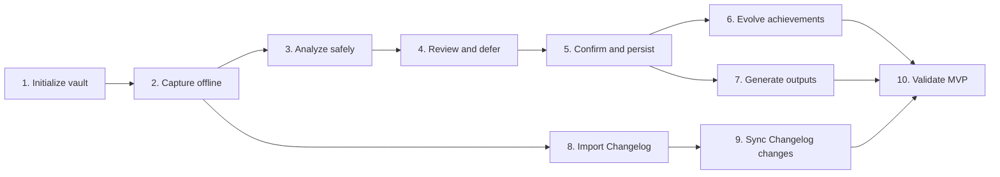

# Brag Document Builder Implementation Plan

## 1. Purpose

This plan breaks [SPEC.md](SPEC.md) into vertical implementation slices. Each slice delivers user-observable behavior, can be tested independently, and avoids depending on functionality assigned to a later slice.

This document does not select answers to the open questions in the SPEC and does not prescribe a layered architecture. Component names below describe responsibilities that may remain simple modules or functions.

## 2. Delivery Principles

- Build one local CLI process.
- Keep Markdown as the sole authoritative store for raw inputs, confirmed facts, and generated content.
- Add only the external dependencies required by the current slice.
- Keep OpenAI-specific code localized without creating a multi-provider framework.
- Use the selected language's standard library for JSON, hashing, UUIDs, dates, and file operations where practical.
- Prefer direct file scanning over a database or search index until measured use requires otherwise.
- Validate each slice through its public CLI behavior and resulting files.
- Do not begin a slice while one of its blocking open questions remains unresolved.

## 3. Open Questions That Gate Implementation

These questions remain open in the SPEC. Resolving them is planning work, not an implementation slice.

| Open question | Blocks |
| --- | --- |
| Implementation language, runtime, and CLI framework | All slices |
| Exact CLI command names, options, and arguments | Final CLI contract for each slice |
| Local path and format for operational configuration | Slices 1, 8, and 9 |
| Exact YAML fields and Markdown section headings | Slices 2, 5, 6, and 7 |
| Human-readable achievement file naming | Slice 5 |
| Stable source reference for multiple entries in a daily inbox | Slice 5 |
| Where `candidate` state is persisted before confirmation | Slices 3 and 4 |
| Specific OpenAI model | Slices 3, 4, and 7 |
| Environment-variable name for the OpenAI API key | Slice 3 |
| Representation of value-assessment dimensions | Slice 3 |
| Per-request input limit and content-size estimate | Slice 3 |
| Selection semantics for arbitrary Markdown Changelogs | Slice 8 |
| Exact versus semantic prevention of repeated rejected suggestions | Slices 5 and 6 |
| Safe acceptance examples and expected results | Slice 10 |

## 4. Slice Order

## 5. Vertical Slices

### Slice 1: Configure and Initialize a Vault

**Observable behavior**

The user configures a default Obsidian vault through the CLI. The CLI creates or verifies the required `Brag/` directory layout and remembers the default vault for later commands.

**Acceptance criteria**

- A user can configure an existing local directory as the default vault.
- The CLI creates `Brag/Inbox/`, `Brag/Achievements/`, `Brag/Archive/Rejected/`, and `Brag/Outputs/` when they do not exist.
- Running initialization again is idempotent and does not alter existing Markdown files.
- An invalid or inaccessible vault path produces an actionable error and no partial configuration.
- Operational configuration contains no achievement content.
- A command-line vault override, if included in the resolved CLI contract, does not replace the saved default.

**Independent tests**

- Run against an empty temporary directory and assert the directory tree.
- Run twice and assert no existing file changes.
- Run against a missing, invalid, or read-only location and assert failure behavior.
- Inspect saved operational configuration and assert that it contains only configuration data.

**Affected components**

- CLI command parsing.
- Vault path validation and directory setup.
- Local operational configuration.

**Dependencies**

- No dependency on AI, achievement parsing, or Changelog ingestion.

**Not included**

- Capturing work.
- Creating achievement files.
- Repository registration.

### Slice 2: Capture Raw Work Offline

**Observable behavior**

The user submits free-form text or answers fixed capture questions. The CLI preserves the submission in a daily Markdown inbox even when no network or OpenAI credentials are available.

**Acceptance criteria**

- Free-form capture appends or writes the submitted text to the correct daily inbox file.
- Prompted capture stores the user's answers without requiring every answer to be complete.
- Original input language and text are preserved.
- Multiple captures on the same day do not overwrite or merge away earlier input.
- Capture succeeds without network access and without an OpenAI API key.
- An interrupted or failed write leaves the previous valid inbox content intact.
- A successful command reports the resulting inbox file.

**Independent tests**

- Capture text into a temporary vault and assert exact retained content.
- Capture multiple entries on the same date and assert that all entries remain.
- Run with network access disabled and no API key.
- Simulate a write failure and assert that the prior file remains valid.

**Affected components**

- Capture CLI commands.
- Capture workflow.
- Daily inbox Markdown rendering.
- Atomic file writing.
- Vault access.

**Dependencies**

- Slice 1 for vault resolution and layout.
- No dependency on AI or achievement files.

**Not included**

- Analysis, value assessment, or follow-up questions.
- Achievement creation.

### Slice 3: Preview and Analyze Inbox Content Safely

**Observable behavior**

The user selects inbox content for analysis, sees exactly what will be sent to OpenAI and its approximate size, explicitly approves transmission, and receives grouped candidate analysis with value assessments.

**Acceptance criteria**

- The CLI displays the exact outbound content before an OpenAI request.
- The CLI displays a sensitive-information warning and requires explicit approval.
- Declining approval sends no request and leaves the inbox unchanged.
- Content above the configured per-request limit is rejected before transmission with an actionable message.
- Missing credentials or an unavailable API leaves the inbox intact and available for retry.
- Analysis groups related activity by project or topic.
- Every analyzed item remains represented as a new candidate, supporting evidence, or retained raw activity.
- Candidate analysis covers impact, difficulty, leadership or ownership, evidence strength, and reusability, plus a concise reason.
- Provider, model, and analysis time are available for later persistence; complete prompts and responses are not written to Markdown.
- API keys do not appear in Markdown, normal output, logs, or handled errors.

**Independent tests**

- Use a fake local OpenAI boundary to assert the exact approved payload.
- Decline transmission and assert zero calls.
- Submit oversized content and assert zero calls.
- Return a fixed structured response and assert displayed grouping and assessment.
- Simulate timeout, authentication failure, and malformed AI output; assert that inbox content remains unchanged.
- Search captured output and files for the test API key.

**Affected components**

- Analysis CLI command.
- Analysis workflow.
- OpenAI integration.
- Input-size estimation and limit enforcement.
- Candidate analysis representation.
- Inbox reading.

**Dependencies**

- Slice 2 for durable inbox content.
- No dependency on confirmed achievement persistence.

**Not included**

- Follow-up dialogue.
- Confirmation or achievement creation.
- Duplicate detection against existing achievements.

### Slice 4: Review Candidates and Defer Missing Details

**Observable behavior**

The user reviews an analyzed candidate, chooses immediate review or deferral, answers no more than three questions in one round, and can skip unresolved questions for later.

**Acceptance criteria**

- Quick capture or deferred review returns without asking follow-up questions.
- Immediate review asks at most three questions in a round.
- Questions target missing context, contribution, scope, constraints, outcome, or evidence.
- A user can answer, skip, or defer each question.
- Deferred questions remain available in a later review.
- Unsupported inferences remain visibly distinct from user-confirmed answers.
- A candidate lacking sufficient facts remains `needs-detail` rather than being represented as confirmed.
- Any cloud request follows the same preview, warning, approval, size-limit, and failure rules as Slice 3.

**Independent tests**

- Review a candidate with more than three missing details and assert only three questions are asked.
- Skip all questions and assert they remain available later.
- Answer enough questions and assert the review can proceed toward confirmation.
- Assert that AI suggestions are not recorded as confirmed answers.
- Decline a follow-up AI call and assert no candidate data is lost.

**Affected components**

- Review CLI command.
- Review and follow-up workflow.
- Candidate lifecycle handling.
- OpenAI integration.
- Candidate persistence location selected from the open questions.

**Dependencies**

- Slice 3 for candidate analysis.
- No dependency on update, merge, or output generation.

**Not included**

- Persisting a confirmed achievement.
- Merging with an existing achievement.

### Slice 5: Confirm and Persist an Achievement

**Observable behavior**

The user confirms grouping, retention value, individual facts, and generated wording in stages. The CLI then creates one authoritative achievement Markdown file or records a rejection.

**Acceptance criteria**

- Confirmation separately covers grouping, retention, facts, and generated wording.
- No inferred fact becomes confirmed without explicit user confirmation.
- A confirmed candidate creates one Markdown file in `Brag/Achievements/`.
- The file has an immutable achievement ID, lifecycle state, required date or period, and source references.
- Confirmed facts are separated from source material and generated wording.
- Optional contextual fields can remain absent.
- Generated content records provider, model, generation time, and language without storing the complete prompt or response.
- A rejection stores its source reference and reason in `Brag/Archive/Rejected/`.
- A failed write leaves no partial achievement and preserves the candidate or inbox source for retry.
- Malformed authoritative Markdown is reported and not silently repaired or overwritten.

**Independent tests**

- Confirm a fixed candidate and parse the resulting frontmatter and sections.
- Reject a fixed candidate and assert the rejection record contains the required information.
- Cancel at each confirmation stage and assert that no later stage is treated as approved.
- Simulate an atomic-write failure and assert no partial achievement file.
- Supply malformed target Markdown and assert refusal plus repair guidance.

**Affected components**

- Confirmation CLI flow.
- Confirmation workflow.
- Achievement data representation.
- YAML frontmatter and Markdown rendering/parsing.
- Rejection records.
- Atomic file writing and validation.

**Dependencies**

- Slice 4 for reviewed candidate facts.
- No dependency on update, merge, aggregate output, or Changelog ingestion.

**Not included**

- Updating an existing achievement.
- Semantic duplicate detection beyond the confirmed rejection behavior.
- Aggregate output documents.

### Slice 6: Attach Evidence and Resolve Achievement Conflicts

**Observable behavior**

When new material resembles an existing achievement, the CLI proposes attaching it, shows duplicate or conflicting facts and their sources, and lets the user merge, create a separate achievement, or ignore it.

**Acceptance criteria**

- Existing achievements are discovered by scanning authoritative Markdown files without a database.
- Renaming or moving an achievement file within the managed achievement area does not change its identity.
- The CLI shows the existing and incoming sources for a proposed attachment or conflict.
- No merge, fact replacement, or source removal occurs without explicit confirmation.
- Creating a separate achievement leaves the existing achievement unchanged.
- Ignoring material preserves the relevant raw source or rejection decision.
- Direct Obsidian edits to confirmed facts take precedence over earlier generated state.
- AI may propose changes to confirmed facts but cannot overwrite them.
- Regeneration changes only the designated generated-content area.
- Malformed achievement files are reported and skipped without modifying them.

**Independent tests**

- Rename an achievement file and assert lookup by immutable ID still works.
- Test merge, separate, and ignore choices against the same fixture.
- Introduce conflicting facts and assert both sources are displayed before confirmation.
- Manually edit a confirmed fact, rerun review, and assert the edit remains authoritative.
- Regenerate content and assert confirmed sections are byte-for-byte unchanged.

**Affected components**

- Achievement scanning and lookup.
- Existing-achievement comparison workflow.
- Conflict and duplicate presentation.
- Achievement update and atomic writing.
- Rejection-repeat handling.

**Dependencies**

- Slice 5 for valid authoritative achievement files.
- No dependency on Changelog ingestion.

**Not included**

- A vector database, embeddings, or external search service.
- Automatic conflict resolution.

### Slice 7: Generate Immediate Feedback and Career Outputs

**Observable behavior**

After confirmation, the user sees immediate value feedback and can generate Chinese or English STAR stories, resume bullets, performance-review summaries, and aggregate output documents from confirmed achievements.

**Acceptance criteria**

- Confirmation feedback shows applicable resume themes, missing evidence, and the strongest supported statement.
- A user can generate STAR, resume-bullet, and performance-summary variants for one confirmed achievement.
- A user can select multiple confirmed achievements and create an aggregate document in `Brag/Outputs/`.
- Outputs use only confirmed facts.
- Missing metrics may appear only as explicit placeholders such as `[X%]`.
- No estimate or inference is presented as a confirmed result.
- Original source language remains unchanged.
- Structured achievement content defaults to Chinese.
- Professional outputs can be requested in Chinese or English.
- Individual generated variants are stored separately from confirmed facts and record language and generation time.
- Regeneration does not alter confirmed facts.
- Every cloud request follows the established preview and approval rules.

**Independent tests**

- Generate all three output forms from a fixed confirmed achievement.
- Generate Chinese and English variants from the same facts.
- Use a fixture with a missing metric and assert only a marked placeholder is emitted.
- Attempt generation from unconfirmed material and assert refusal.
- Generate an aggregate document and verify its selected source achievement IDs.
- Compare confirmed sections before and after regeneration.

**Affected components**

- Generate CLI command.
- Feedback and output workflows.
- OpenAI integration.
- Achievement and aggregate Markdown rendering.
- Output file writing.

**Dependencies**

- Slice 5 for confirmed achievements.
- Slice 6 is required only when output should include achievements updated through attachment or conflict resolution.

**Not included**

- Job-specific tailoring.
- Saved output profiles.
- Charts or dashboards.

### Slice 8: Register a Repository and Import Selected Changelog Content

**Observable behavior**

The user registers a local repository and Changelog path, selects an allowed initial range, previews the exact source content, and imports it into the inbox without requiring one specific Markdown Changelog format.

**Acceptance criteria**

- The user can register, list, and remove explicit repository and Changelog-path pairs.
- Registration rejects missing repositories, missing Changelogs, and inaccessible paths without partial state.
- The CLI never discovers or scans unrelated repositories automatically.
- Initial import requires the user to select a supported date, version, or section range according to the resolved selection semantics.
- The selected original Changelog text is preserved in the inbox.
- Import does not require OpenAI availability.
- If analysis is requested, the exact selected text is shown and approved before transmission.
- Arbitrary Markdown is retained as source text even if AI interpretation fails.
- Operational configuration stores paths and import metadata, not achievement content.

**Independent tests**

- Register and remove repositories using temporary paths.
- Attempt invalid registrations and inspect unchanged operational state.
- Import selected content from multiple Markdown structures.
- Assert content outside the selected range is not imported or transmitted.
- Disable network access and assert the selected source still reaches the inbox.

**Affected components**

- Repository-management CLI commands.
- Repository and Changelog configuration.
- Changelog range selection and reading.
- Capture/inbox workflow.
- Optional connection to the Slice 3 analysis workflow.

**Dependencies**

- Slice 1 for operational configuration.
- Slice 2 for durable inbox capture.
- Analysis reuses Slice 3 but import itself does not depend on AI.

**Not included**

- Git commit-history ingestion.
- GitHub API access.
- Incremental change detection.

### Slice 9: Incrementally Process Changelog Changes

**Observable behavior**

Repeated Changelog imports skip unchanged sections. When a previously imported section changes, the CLI shows the difference and identifies potentially affected achievements without modifying confirmed facts.

**Acceptance criteria**

- Imported source sections receive deterministic content hashes.
- Re-importing unchanged content creates no duplicate inbox entry and no duplicate AI request.
- New sections can be selected and imported normally.
- Changed sections update retained source material only after user confirmation.
- The CLI identifies candidate achievements that may be affected and shows the relevant source difference.
- Confirmed facts remain unchanged until separately reviewed and approved through the Slice 6 flow.
- Deleting rebuildable import ledger data does not delete Markdown content.
- Import hashes can be reconstructed from registered sources and retained Markdown.

**Independent tests**

- Import the same section twice and assert one retained source and one analysis at most.
- Modify a section and assert the displayed change and affected-candidate behavior.
- Decline the changed-source update and assert existing retained content remains.
- Delete operational import state, rebuild it, and assert authoritative Markdown is unchanged.
- Simulate a ledger write failure and assert no achievement content is lost.

**Affected components**

- Changelog section hashing.
- Import ledger.
- Changed-source comparison.
- Achievement source lookup.
- Review handoff.

**Dependencies**

- Slice 8 for registered sources and initial imports.
- Slice 6 for applying reviewed changes to existing achievements.

**Not included**

- Background watching or scheduled imports.
- Automatic confirmed-fact updates.

### Slice 10: Validate the Complete MVP Against Realistic Examples

**Observable behavior**

The complete CLI is exercised against the agreed safe examples, and a repeatable result reports whether the MVP meets its quality and processing-time thresholds.

**Acceptance criteria**

- The evaluation set contains at least ten safe, realistic examples.
- It includes fragmented notes, commit or Changelog summaries, clear achievements, routine work that accumulates into an achievement, and duplicate or conflicting records.
- No raw input is lost.
- At least 80% of proposed groupings are accepted by the user.
- No more than 10% of worthwhile achievements are missed.
- At least 70% of generated wording requires only minor edits.
- Average processing time is no more than five minutes per input.
- Missed achievements are reported separately from false positives.
- Failures can be traced to the source example and workflow stage without exposing API keys.

**Independent tests**

- Run the full evaluation from a clean temporary vault and clean operational state.
- Repeat the evaluation with fixed AI responses to verify deterministic workflow behavior.
- Exercise OpenAI failure during capture and verify zero input loss.
- Inspect all resulting Markdown for source traceability, fact/generation separation, and lifecycle correctness.

**Affected components**

- End-to-end CLI.
- Evaluation fixtures and result calculation.
- All workflows and persistence responsibilities delivered by prior slices.

**Dependencies**

- Slices 1 through 9.
- The acceptance examples and expected results must be supplied before this slice begins.

**Not included**

- Features listed as non-goals or deferred possibilities in the SPEC.
- Architecture changes that are not justified by observed evaluation failures.

## 6. Dependency Introduction by Slice

Dependencies are selected only after the implementation language is resolved.

| Capability | Earliest slice | Justification |
| --- | --- | --- |
| CLI parsing | Slice 1 | Explicit subcommands are required by the SPEC. Prefer the standard library unless it cannot support the confirmed interaction. |
| YAML parsing | Slice 5 | Structured achievement frontmatter first becomes necessary when achievements are persisted. |
| OpenAI SDK | Slice 3 | Cloud analysis first appears here. A provider-neutral plugin framework is not required. |
| Markdown parser | None by default | Fixed application-owned sections can be handled without a full Markdown AST. Add only if the resolved format or tests demonstrate a need. |
| Database or ORM | None | Markdown is authoritative, and direct scanning satisfies the current single-user scale. |
| Embeddings or vector search | None | Current duplicate and conflict review does not establish a need for separate search infrastructure. |
| Background queue or scheduler | None | All operations are manually initiated and synchronous in the SPEC. |
| Dependency injection container | None | Direct construction and parameter passing are sufficient for the current CLI process. |

## 7. Completion Rule

A slice is complete only when its observable CLI behavior and acceptance criteria pass without relying on unfinished behavior from a later slice. Failures should be corrected within the current slice unless they demonstrate that a confirmed SPEC decision or blocking open question must be revisited.