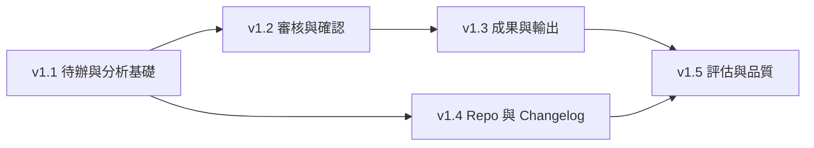

# Brag Document Builder Web 完整版實作計畫

## 1. 目的

本計畫將 `SPEC2.md` 拆成 `v1.1` 至 `v1.5` 五個可獨立驗證的垂直版本。

每個版本必須：

- 交付使用者可操作的完整行為。
- 延續 Markdown 權威與 atomic write。
- 維持既有 CLI 相容性。
- 在進入下一版本前完成自動測試與 Web 煙霧測試。
- 不把下一版本尚未需要的抽象提前加入。

## 2. 實作原則

- Web route 不直接複製 CLI 業務邏輯；先抽取可重用 workflow 函式，再由 CLI 與 Web 呼叫。
- Flask route 負責輸入驗證、HTTP 狀態與 response shape，不負責權威檔案規則。
- 前端以既有原生 HTML/CSS/JavaScript 為基礎，除非複雜度證明需要框架。
- 操作狀態必須可重建，且不能包含 API Key。
- 先補最便宜且能推翻假設的行為測試，再做相鄰功能。
- 每一版都更新使用文件與 CHANGELOG，並依 SemVer 獨立發布。

## 3. 版本依賴

## 4. v1.1：待辦與分析基礎

### 4.1 使用者成果

使用者開啟首頁即可看到今日摘要與所有未完成待辦，能只分析今日尚未處理的 Capture，並在完整安全預覽後取得可於稍後繼續的候選結果。

### 4.2 實作範圍

#### Capture 身分

- 為新 Capture 寫入 immutable capture ID 與穩定來源參照。
- 解析既有 Inbox 區塊。
- 為 legacy Capture 產生不改寫 Markdown 的可重建 ID。
- 計算 Capture 內容 hash。

#### 操作狀態

- 定義版本化、atomic 的 analysis state schema。
- 保存 capture ID、hash、分析時間、模型、候選與來源參照。
- 提供 state rebuild 或安全重建策略。
- 防止重複分析與重複寫入。

#### 首頁

- 今日新增 Capture。
- 今日未分析 Capture。
- 全部待補件與待確認數量。
- 最近活動與來源變更警示。
- 入口導向 Capture、Analyze 與 Review。

#### Analyze 工作台

- 預設選擇今日未分析項目。
- 可切換今日全部或指定 Capture。
- 顯示項目清單、bytes、模型與來源。
- 必看 AI 安全預覽 modal。
- 顯示 loading、成功、取消與失敗狀態。
- 分析成功後保存候選並更新待辦。

#### Hash 變更

- 相同 hash 已分析項目略過。
- 來源 hash 改變時標記 stale。
- 使用者明確選擇後才重新分析。
- 舊分析保留 traceability。

### 4.3 不包含

- 候選問答與確認。
- Merge/Attach。
- 輸出生成。
- Repo 匯入 UI。

### 4.4 驗收標準

- 新舊 Inbox Capture 都有穩定可重建 ID。
- Capture 先寫 Markdown，再更新操作狀態。
- 首頁能顯示全部未完成與今日摘要。
- 預設分析不重送今日已處理 Capture。
- 所有 AI 呼叫必須先顯示完整 preview。
- 取消 preview 時零 API 呼叫、零狀態改變。
- AI 失敗時 Inbox 與既有分析狀態保持有效。
- 修改來源後顯示 stale，不自動重送。

### 4.5 測試

- Capture ID 生成與 legacy rebuild 測試。
- 多 Capture、相同 hash、修改 hash 測試。
- State atomic write 與 malformed state 測試。
- Dashboard API 計數測試。
- Preview 取消、bytes 超限、missing key、API failure 測試。
- Web browser：Capture → Analyze → Dashboard 更新。

## 5. v1.2：候選審核與確認

### 5.1 使用者成果

使用者能從候選列表快速篩選，再進入逐筆工作台補件、延後、拒絕、確認或附掛到既有成果，全程清楚區分 AI 建議與確認事實。

### 5.2 實作範圍

#### 候選列表

- 狀態、project/topic、classification 篩選。
- 文字搜尋與來源變更標記。
- 顯示 reason、價值評分與缺少欄位。
- 多筆選取後依序進入逐筆模式。

#### 逐筆審核

- 三欄工作台與專注模式。
- 顯示來源 Capture、AI 分析與既有答案。
- 每輪最多三個 follow-up。
- 回答、skip、defer。
- AI follow-up 需使用同一安全 preview。
- 建議 inference 與 confirmed answer 分區。

#### 分階段確認

- Group/split。
- Worth retaining。
- Individual facts。
- Generated wording。
- 顯示進度、返回、取消與尚未確認項目。

#### Reject

- 必填拒絕理由。
- 寫入 Rejected Markdown。
- 保留 source reference。
- 更新候選狀態並避免重複提案。

#### Attach 與衝突

- 掃描 authoritative achievements。
- 提議 target achievement。
- Merge、Separate、Ignore。
- 並排顯示 incoming/existing facts 與 sources。
- 每個衝突欄位單獨確認。
- Malformed achievement 跳過並顯示警告。

### 5.3 驗收標準

- 候選可由列表進入逐筆審核並返回原篩選狀態。
- 每輪 follow-up 不超過三題。
- Defer 後待辦仍存在。
- AI inference 不會自動寫入 confirmed facts。
- 任一確認階段取消時不會執行後續寫入。
- Reject、Merge、Separate、Ignore 都保留來源追溯。
- Merge 不能未經同意覆寫確認事實。
- 使用者在 Obsidian 的直接修改保持權威。

### 5.4 測試

- 列表篩選、分頁或大量候選測試。
- Follow-up 上限、skip、defer、resume 測試。
- 四階段逐段取消測試。
- Reject atomic write 測試。
- Merge/Separate/Ignore 與衝突確認測試。
- Browser E2E：候選列表 → 補件 → Confirm/Reject。

## 6. v1.3：成果與輸出

### 6.1 使用者成果

使用者能搜尋與管理確認成果，產生中文或英文 STAR、履歷條列、績效摘要與聚合文件，並在寫入後立即查看內容與檔案位置。

### 6.2 實作範圍

#### Achievements 瀏覽

- 掃描 Markdown 並以 immutable ID 建立列表。
- 搜尋、狀態、project、skill 篩選。
- 顯示 confirmed facts、sources、generated sections。
- 顯示 missing evidence 與 strongest supported statement。
- 封存，不提供永久刪除。

#### Generate Outputs

- 選擇一或多個 confirmed achievements。
- STAR、resume bullet、performance summary。
- `zh-TW` 與 `en`。
- 直接寫入 achievement 或 `Outputs/`，再顯示結果。
- 支援 aggregate name。
- 缺少 metric 使用明確 placeholder。

#### Regeneration

- 指定 output type 與語言重生。
- 只更新 generated section。
- 顯示生成時間與模型 metadata。
- confirmed facts byte-for-byte 不變。

### 6.3 驗收標準

- Rename/move 後仍以 immutable ID 找到成果。
- Unconfirmed candidate 不可用於輸出。
- 輸出只使用確認事實。
- Missing metric 不得生成假數字。
- 聚合文件包含所有選定 achievement IDs。
- 寫入成功後 Web 顯示內容與實際路徑。
- 封存後仍可搜尋與查看，但預設不進入一般輸出選擇。

### 6.4 測試

- Achievement scan、malformed file、rename/move 測試。
- 三種輸出、雙語、placeholder 測試。
- Aggregate output 測試。
- Regeneration confirmed facts 不變測試。
- Browser E2E：選成果 → 生成 → 查看輸出。

## 7. v1.4：Repository 與 Changelog

### 7.1 使用者成果

使用者能在 Web 設定多個允許的 Repository 根目錄，明確註冊 repo/changelog，預覽並匯入指定範圍，且能安全處理後續來源變更。

### 7.2 實作範圍

#### Repository 根目錄

- Web 設定頁新增、驗證、移除多個根目錄。
- File picker 只能瀏覽允許根目錄。
- 不自動掃描或註冊子目錄。
- Docker 路徑映射需顯示主機與容器路徑關係。

#### 註冊管理

- Register repo + changelog。
- List 與 remove。
- 顯示可存取性與最後匯入時間。
- 阻止重複或越界路徑。

#### Changelog 匯入

- 讀取 heading 並選擇 from/to range。
- 顯示 exact source preview。
- 明確 IMPORT 確認。
- 先寫 Inbox，再可選 Analyze。
- 任意 Markdown 格式仍保留原文。

#### 增量與 Ledger

- 顯示 content hash 與 unchanged skip。
- 來源修改後顯示 unified diff。
- 顯示可能受影響 achievement。
- 確認後更新 retained source。
- Ledger rebuild UI、進度與摘要。

### 7.3 驗收標準

- 可管理多個根目錄但不自動掃描。
- 不允許選取根目錄外路徑。
- 無效註冊不留下部分設定。
- 匯入範圍外文字不寫入、不傳送。
- Offline 時仍可完成匯入。
- Unchanged re-import 不產生重複 Inbox 或 API call。
- Changed source 不自動修改 confirmed facts。
- Ledger rebuild 不破壞 Markdown。

### 7.4 測試

- 多 root、路徑 traversal、Docker 映射測試。
- Register/list/remove API 與 UI 測試。
- Heading range 與任意 Markdown 測試。
- Import preview 取消與 offline 測試。
- Hash skip、diff、affected achievements 測試。
- Ledger rebuild failure safety 測試。

## 8. v1.5：MVP Eval、設定與品質完善

### 8.1 使用者成果

使用者可從 Web 執行 MVP 評估、檢查系統設定與修復操作狀態；所有核心流程具備一致的錯誤處理、專注模式、響應式與無障礙品質。

### 8.2 實作範圍

#### MVP Eval UI

- Fixture 檔案選擇。
- Deterministic 與 simulate failure 控制。
- 執行進度與取消。
- Report path、threshold summary、missed/false positives。
- 逐案例 traceability。

#### 設定中心

- Vault、default model、max bytes。
- Repository roots 與 registrations。
- Analysis state/ledger rebuild。
- API Key 完全不顯示、不編輯；缺少時提供說明。

#### 介面品質

- 專注模式。
- 桌面與窄視窗 responsive。
- Keyboard focus 與可見 focus state。
- Loading、empty、error、partial failure、retry 狀態。
- 防止重複提交。
- AI generated content 清楚標示。
- 所有高風險操作具備明確影響摘要。

#### 啟動與容器

- Docker Web service 與 CLI service 共存。
- 一鍵啟動 Web 並輸出本機 URL。
- Health endpoint。
- `.env.example` 與 README 完整更新。

### 8.3 驗收標準

- Web 可執行既有 `mvp-eval` 所有模式並查看報告。
- 報告與畫面不洩漏 API Key。
- 主要流程全鍵盤可操作。
- 三欄與專注模式在指定 viewport 無重疊。
- 所有寫入按鈕有 loading 與防重複提交。
- Docker 啟動後可完成 Capture → Analyze → Review → Confirm → Generate。
- 既有 63+ CLI 測試全部通過，新增 Web 測試全部通過。

### 8.4 測試

- MVP Eval API/UI 與 secret leakage 測試。
- Settings validation 與 rebuild 測試。
- Accessibility 基本檢查。
- Playwright desktop/mobile screenshots。
- Responsive overflow 與文字重疊檢查。
- Docker build、health、mounted Vault smoke test。
- 完整 E2E golden path 與 failure paths。

## 9. 跨版本工作項目

每一版都必須處理：

- API request/response schema 測試。
- Atomic write 與失敗回復。
- 祕密不出現在 logs、Markdown、state、error response。
- Web 與 CLI 行為一致性。
- README 與操作說明更新。
- CHANGELOG、SemVer、annotated tag 與核准式發布流程。

## 10. 風險與控制

### 10.1 CLI 邏輯重複

風險：Web route 直接呼叫互動式 command，導致 `input()`、print 與 HTTP 混雜。

控制：先抽出 non-interactive workflow 函式；CLI adapter 與 Web adapter 分離。

### 10.2 操作狀態成為第二權威來源

風險：候選 JSON 與 Markdown 不一致。

控制：狀態包含 source ID/hash，所有權威讀取回到 Markdown；提供 stale/rebuild。

### 10.3 重複 AI 費用

風險：分析整日 Inbox 或重送相同內容。

控制：Capture-level hash、預設未分析範圍、preview 顯示範圍與 bytes。

### 10.4 Docker 路徑與主機路徑混淆

風險：Web 設定 Windows 路徑但容器不可存取。

控制：根目錄保存 logical ID、host path 與 mounted path；UI 清楚顯示映射與驗證結果。

### 10.5 大型單檔 Web 模板

風險：目前 `web_app.py` 內嵌 HTML/CSS/JS，後續難以測試與維護。

控制：在 v1.1 初期拆分 Flask app、templates、static assets 與 workflow services，但不引入前端框架。

## 11. 完成定義

每個版本完成前必須：

1. 該版本所有驗收標準通過。
2. 新增功能有窄範圍單元/API 測試。
3. 至少一條 browser E2E 覆蓋主要成功路徑。
4. 既有 CLI 測試無回歸。
5. 沒有 API Key 或秘密出現在 staged diff、測試輸出與產出檔案。
6. 文件與實際指令一致。
7. 依個人 Git workflow 完成獨立核准後才 commit、tag、push。
